# 六階段練習流程圖解說

本文件用流程圖說明 [`01_cot.py`](01_cot.py) 到 [`06_langgraph.py`](06_langgraph.py) 六個練習的**資料怎麼流、誰呼叫誰、跟上一階差在哪**。

| 階段 | 檔案 | 核心機制 | 資料來源 |
|------|------|----------|----------|
| 1 | `01_cot.py` | Chain-of-Thought | `shops.json`（整包塞 prompt） |
| 2 | `02_react.py` | ReAct 工具迴圈 | `shops.json`（工具查詢） |
| 3 | `03_rag.py` | RAG 檢索增強 | `data/docs/*.md` |
| 4 | `04_subagent.py` | Subagent 委派 | RAG + `shops.json` + 距離工具 |
| 5 | `05_a2a_*.py` | Agent-to-Agent | 本地 RAG + 遠端 HTTP 服務 |
| 6 | `06_langgraph.py` | LangGraph StateGraph | 同階段 3 + 5 的模擬資料 |

---

## 階段 1：CoT（Chain-of-Thought）

**測試題：** 幫我用資料集裡的店，排台南一日美食行程（週三出發，預算 800 元）。

**重點：** 同一題問兩次，差別只在 prompt 有沒有要求「先推理、後結論」。沒有工具、沒有檢索，全部台南店家直接塞進 prompt。

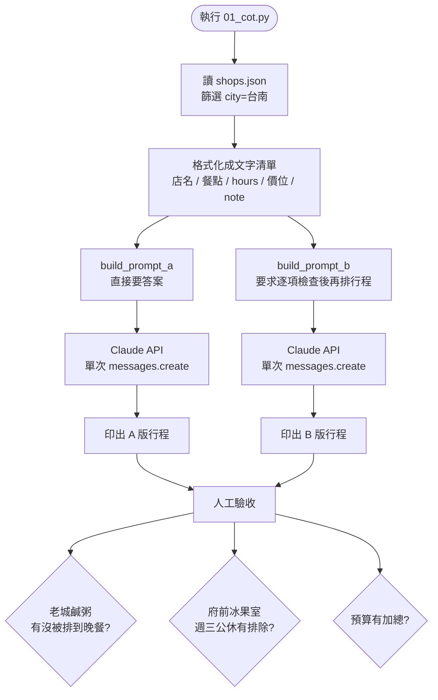

### 推理檢查清單（B 版 CoT 引導）

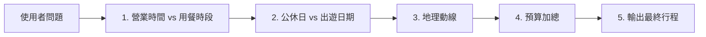

**跟下一階的差別：** CoT 只能重新排列 prompt 裡已有的資訊；無法回答「現在幾點、這家店此刻開不開」這類需要即時查詢的問題。

---

## 階段 2：ReAct（Reason + Act）

**測試題：** 現在晚上 11 點在逢甲，資料集裡的宵夜哪家還開著而且最近？

**重點：** 手刻 `while` 迴圈，模型在 Thought → Action → Observation 之間循環，直到不再呼叫工具。

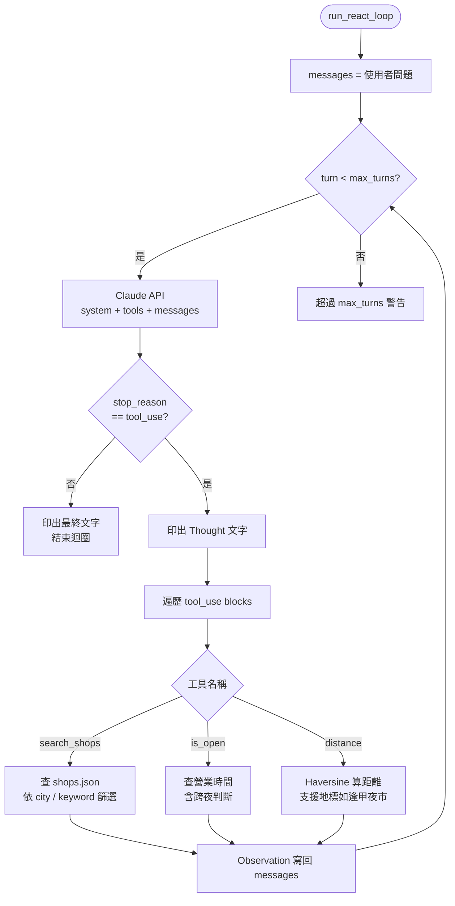

### 典型解題路徑（測試題）

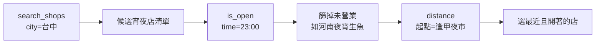

**陷阱：** 河南夜宵生魚名氣大但 00:00 才開——只做關鍵字比對、不呼叫 `is_open()` 就會答錯。

---

## 階段 3：RAG（Retrieval-Augmented Generation）

**測試題：** 資料集裡的碗粿老店中，哪一家只賣碗粿和魚羹、均一價 35 元？出自哪一篇店家介紹？

**重點：** 同一題跑 A / B / C 三版，對照「沒文件 → 全文 → 檢索 top-3」的差異。

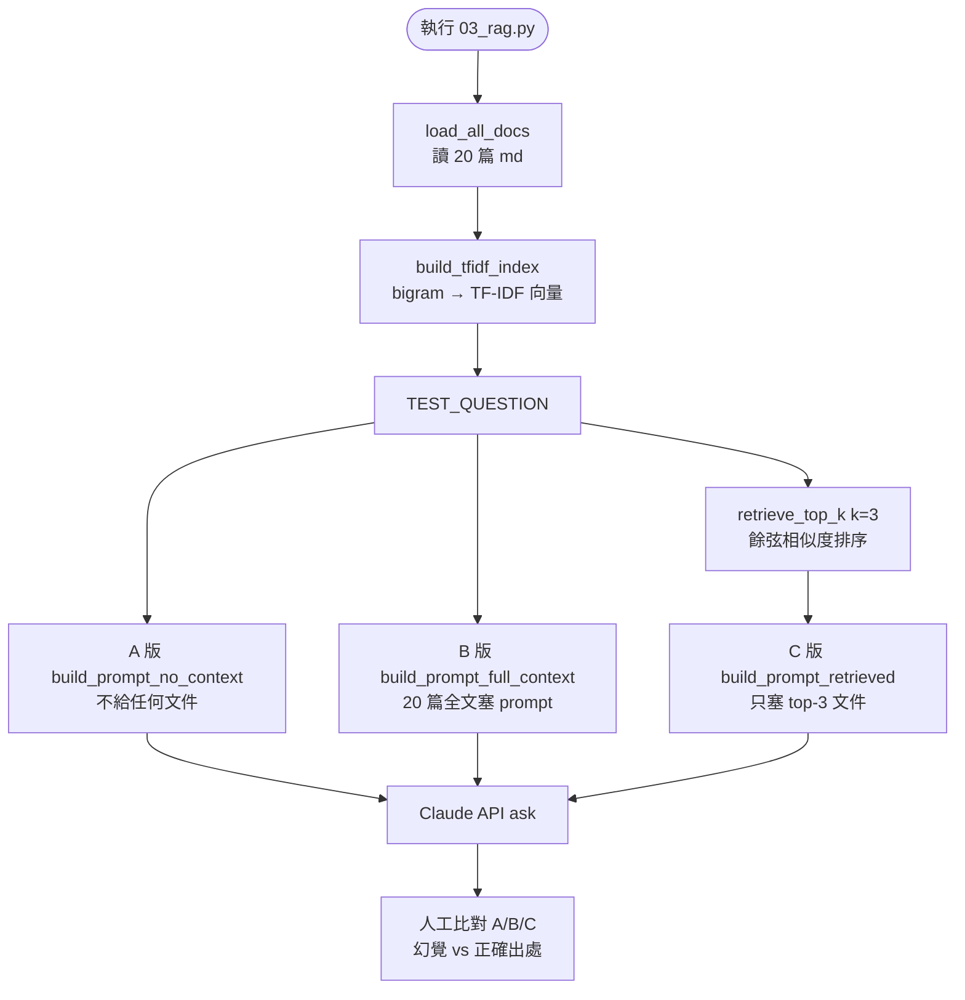

### 檢索管線（C 版）

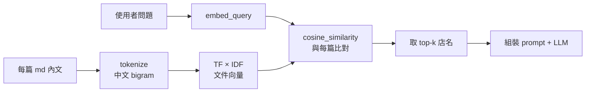

**跟階段 2 的差別：**

| | `search_shops`（階段 2） | RAG（階段 3） |
|---|---|---|
| 查詢方式 | 結構化欄位比對 | 語意/字面相似度 |
| 適合 | 「台中有哪些店」 | 「均一價 35 元的細節在哪篇」 |
| 資料 | `shops.json` | `docs/*.md` |

---

## 階段 4：Subagent（多專才委派）

**測試題：** 兩天一夜台中美食之旅，預算 3000，不騎車用大眾運輸。

**重點：** 一個 orchestrator 依序委派三位子 agent，各自有獨立 `messages`、不同工具集；子 agent 互相看不到對方 context。

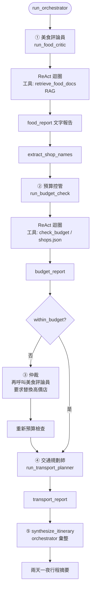

### Context 隔離示意

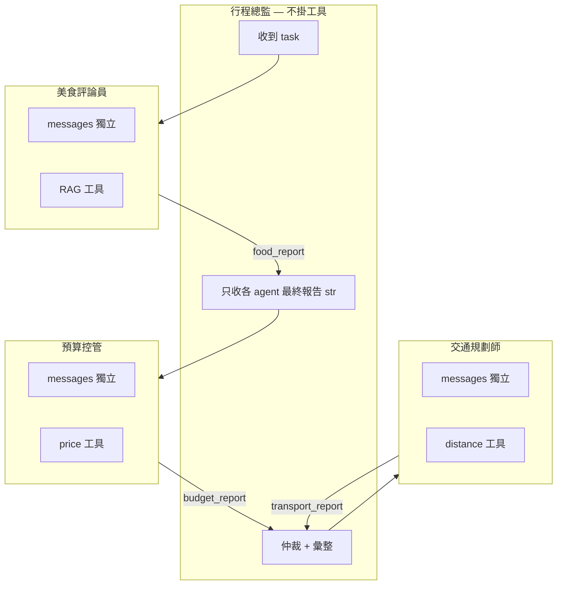

**刻意衝突：** 評論員不知道預算，可能把河南夜宵生魚等高價宵夜排進去 → 預算控管判定超標 → orchestrator 仲裁。

---

## 階段 5：A2A（Agent-to-Agent）

**測試題：** 這週末去台南吃資料集裡的名店，會下雨嗎？怎麼搭車？

**重點：** 兩個獨立 HTTP 服務（port 8500 / 8600），美食 agent 執行時才向旅遊 agent 要 agent card，動態組合工具清單。

### 系統架構

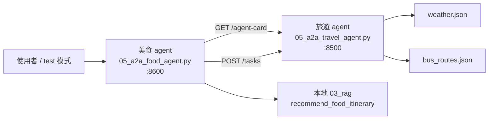

### 美食 agent 核心迴圈

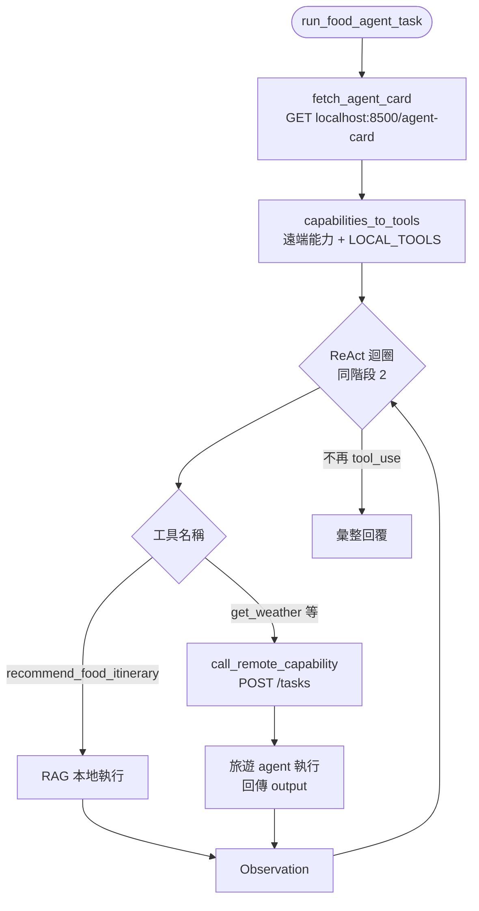

### 旅遊 agent 請求處理

```mermaid
flowchart TD
    GET[GET /agent-card] --> CardJSON[回傳 AGENT_CARD<br/>name / description / capabilities]
    POST[POST /tasks] --> Parse[解析 capability + input]
    Parse --> Handler{CAPABILITIES 對照表}
    Handler -->|get_weather| W[get_weather]
    Handler -->|search_bus_routes| B[search_bus_routes]
    W --> Resp[status: completed<br/>output: {...}]
    B --> Resp
```

**跟階段 4 的差別：**

| | Subagent（階段 4） | A2A（階段 5） |
|---|---|---|
| 部署 | 同一支 Python 程式 | 兩個 HTTP 服務 |
| 能力發現 | 寫程式時就知道 | 執行時讀 agent card |
| 通訊 | 函式呼叫 | JSON-over-HTTP |
| 信任邊界 | 同 process | 跨服務 |

---

## 階段 6：LangGraph（框架對照）

**測試題：** 同階段 5——這週末去台南吃資料集裡的名店，會下雨嗎？怎麼搭車？

**重點：** 用 LangGraph 的 `StateGraph` 把「美食 / 天氣 / 公車 / 彙整」做成 node + edge，對照階段 4 手刻 orchestrator 與階段 5 跨服務 A2A。**本檔案 node 實作為 TODO 骨架。**

### 規劃中的 Graph（序列版）

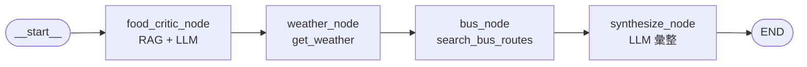

### 共享 State（TripState）

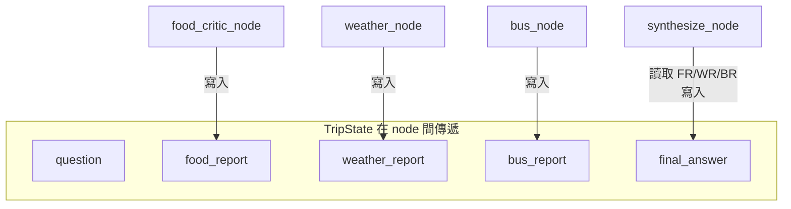

### 延伸：平行 fan-out / fan-in

三個 node 彼此不依賴輸出，可改為平行執行後再匯入 synthesize：

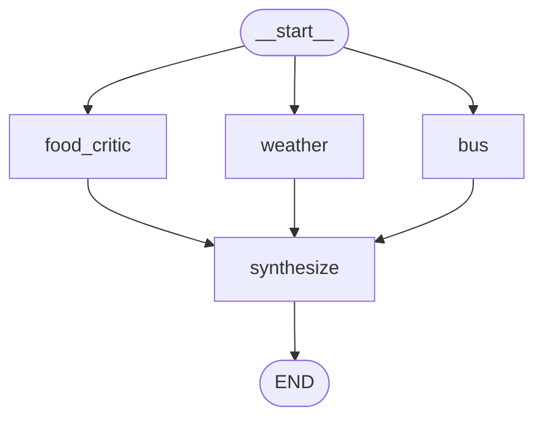

### 三階段對照（同一測試題）

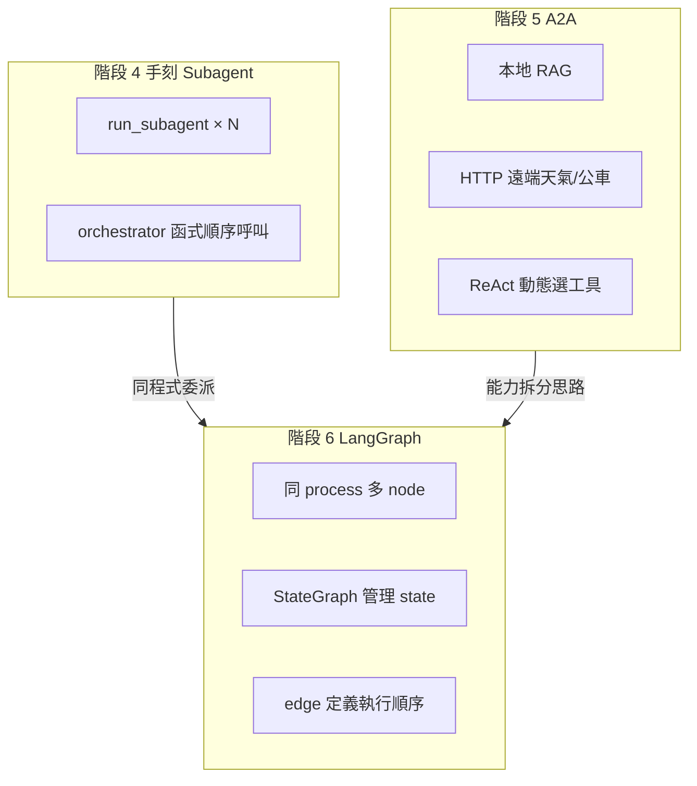

| 維度 | 階段 4 手刻 | 階段 5 A2A | 階段 6 LangGraph |
|------|-------------|------------|------------------|
| 編排方式 | Python 函式順序 | ReAct + HTTP | node / edge |
| 狀態 | 各自 messages + 字串報告 | HTTP 回應 | 共享 TripState |
| Context 隔離 | 刻意隔離 | 服務邊界隔離 | 預設共享 state |
| 可見性 | 高（全在程式裡） | 中（HTTP 可 log） | 低（框架內部） |

---

## 六階段演進總覽

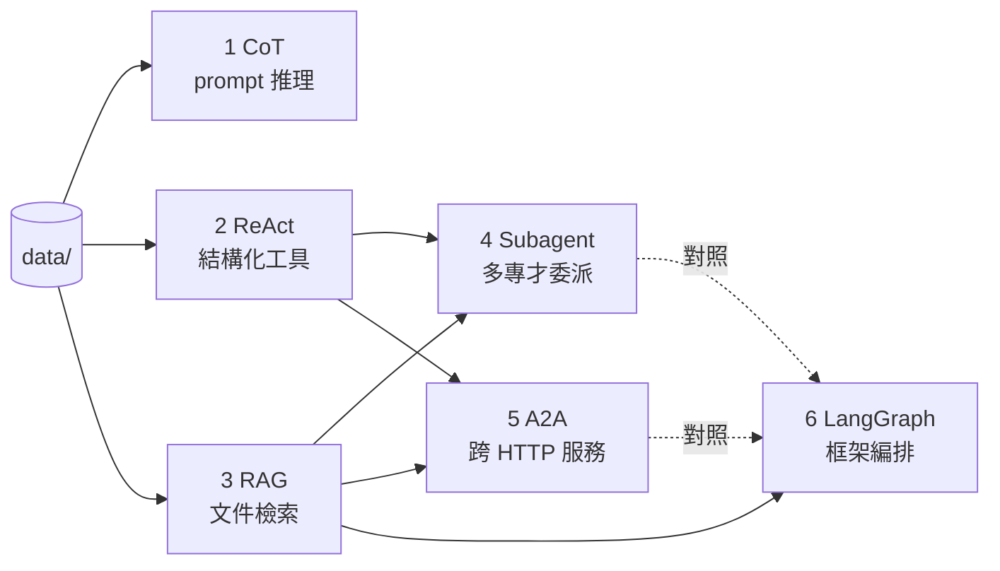

**閱讀建議：**

1. 先跑 [`01_cot.py`](01_cot.py) → [`02_react.py`](02_react.py)，理解「只有 prompt」vs「能查資料」。
2. 再跑 [`03_rag.py`](03_rag.py)，理解「結構化查詢」vs「文件檢索」。
3. [`04_subagent.py`](04_subagent.py) 把 2 + 3 拆成不同專才；[`05_a2a_food_agent.py`](05_a2a_food_agent.py) 把能力拆到不同服務。
4. 最後做 [`06_langgraph.py`](06_langgraph.py)，對照手刻版省了什麼、藏了什麼。

更多實測結果與機制筆記見 [NOTES.md](NOTES.md)；各階段驗收標準見 [PLAN.md](PLAN.md)。
